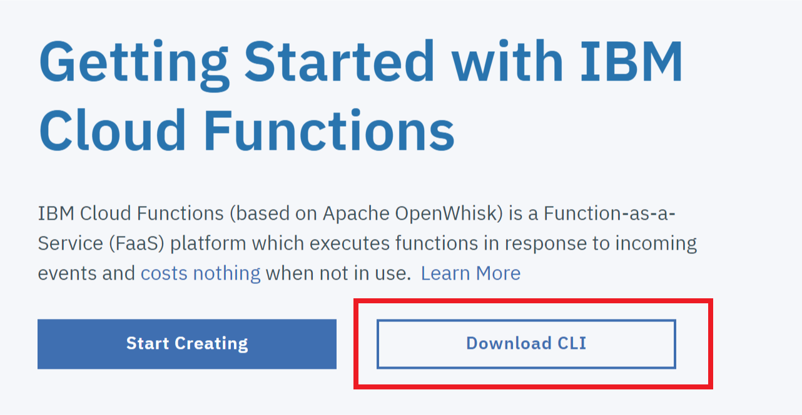
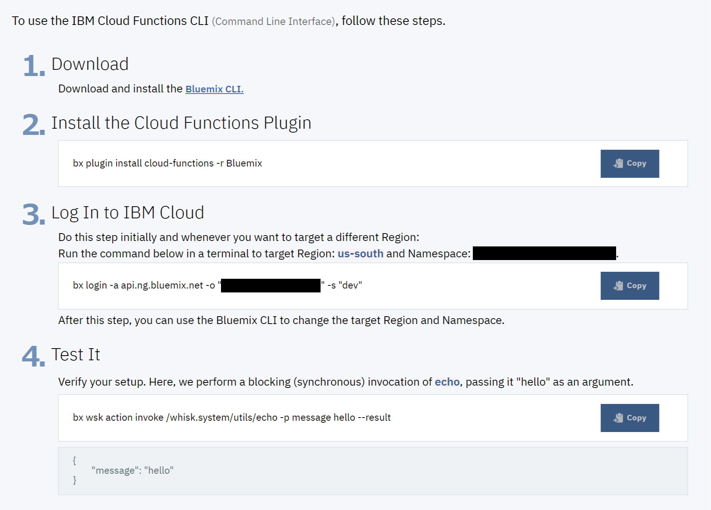

*다른 언어로 보기: [English](FUNCTIONS.md).*

## Sign up for a Bluemix account
먼저 [bluemix.net](https://console.ng.bluemix.net/)에서 무료 계정에 가입하십시오. 계정을 활성화 한 후, 조직(예. *MyACMEorg*)과 작업 공간 (예. *test*)을 생성 후 왼쪽 탐색 메뉴에서 Functions를 클릭 하십시오.

## CLI를 설치하고, 설정하고 테스트 하십시오
"Download CLI" 버튼을 클릭하십시오.

그 다음 설치, 설정 그리고 연결 테스트 단계를 따르십시오. 참고로, 여기에는 인증 키가 표시되지 않습니다.

