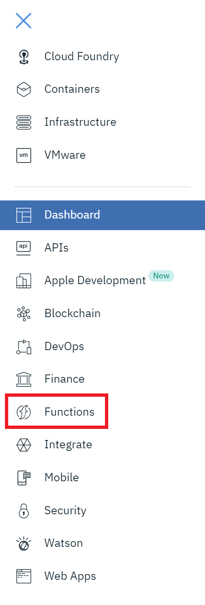
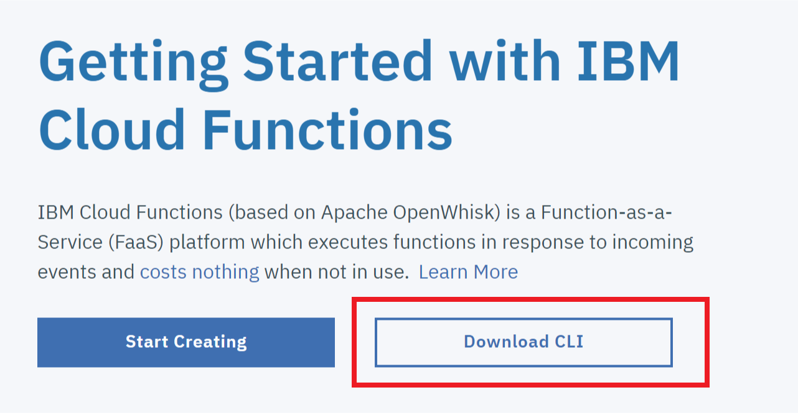
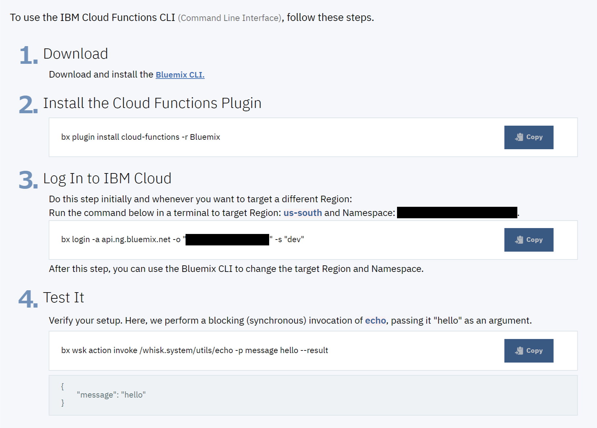

*Read this in other languages: [한국어](FUNCTIONS-ko.md).*

## Sign up for a Bluemix account
Begin by going to [bluemix.net](https://console.ng.bluemix.net/) and signing up for a free account. After you activate your account, set an organization (for example, *MyACMEorg*) and space (for example *test*), click on Functions in the left navigation.

## Download, install, log in, and test the CLI
Once there, click the "Download CLI" button.

Then, follow the four steps to download, install, log in, and test connectivity. Note that the organization is not shown here.

